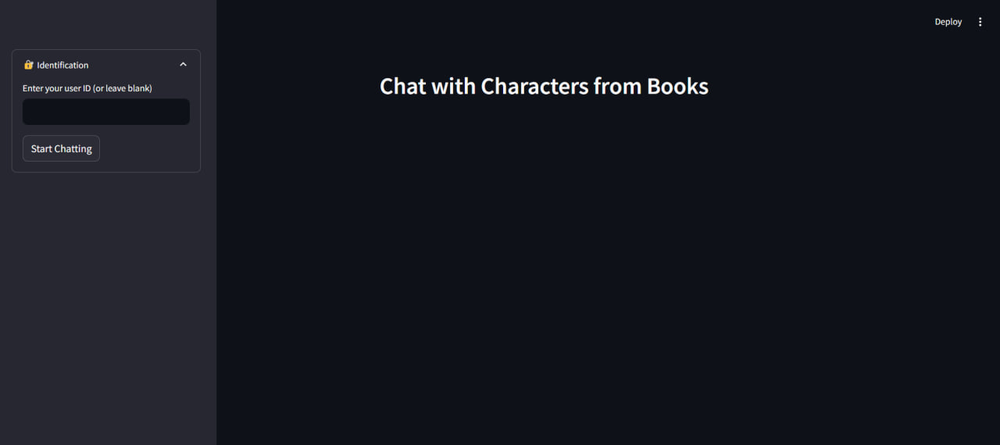
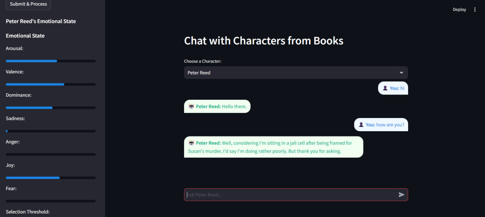
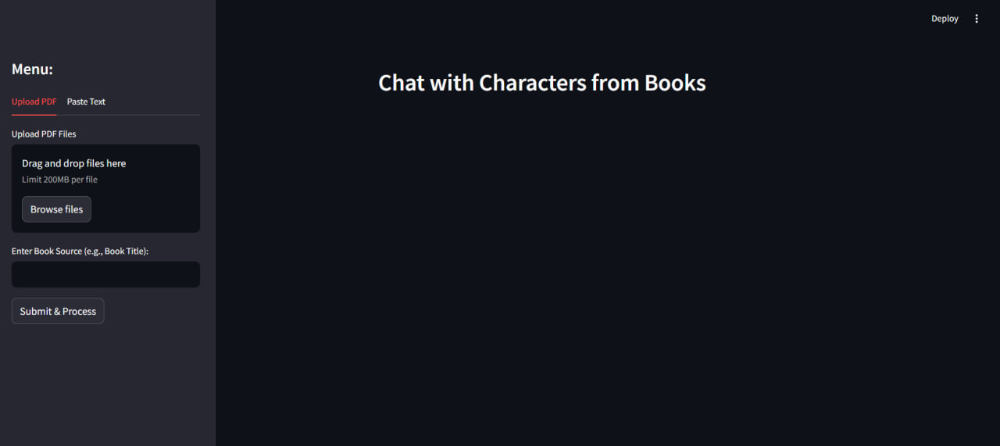
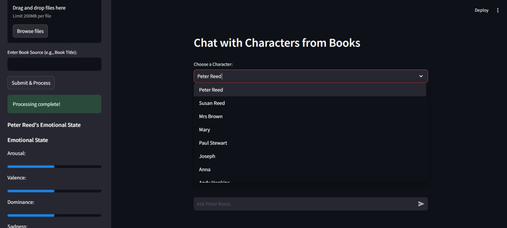
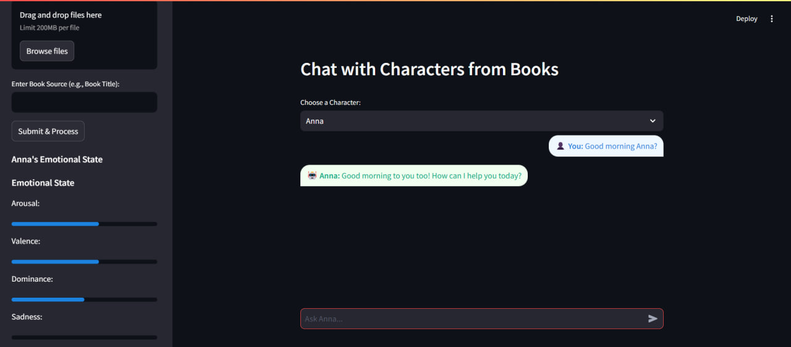
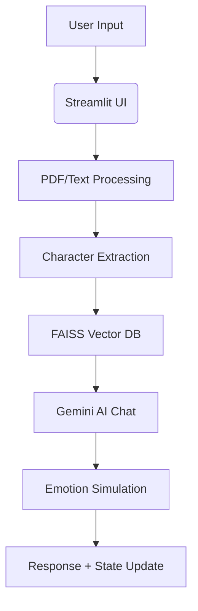

# **Character Chatbot - Interactive Book Character Conversations**

<div style="display: flex; justify-content: space-between;">
  
  

</div>
**A Streamlit-based AI chatbot that lets you chat with characters from books, powered by Google Gemini AI.**

---

## **📌 Table of Contents**

1. [Project Overview](#-project-overview)
2. [Key Features](#-key-features)
3. [Installation Guide](#-installation-guide)
4. [Usage Instructions](#-usage-instructions)
5. [Screenshots](#-screenshots)
6. [Technical Architecture](#-technical-architecture)
7. [Future Improvements](#-future-improvements)
8. [Contributing](#-contributing)
9. [License](#-license)

---

## **🌟 Project Overview**

This project enables users to:  
✔ **Upload books (PDFs) or paste text** to extract characters.  
✔ **Chat with book characters** in an interactive, personality-driven way.  
✔ **Track emotional states** of characters (changes based on conversation).  
✔ **Save conversations** (for logged-in users).

Built with:

- **Google Gemini AI** (for text processing & chat)
- **FAISS** (vector storage for semantic search)
- **Streamlit** (interactive web UI)

---

## **✨ Key Features**

| Feature                  | Description                                        |
| ------------------------ | -------------------------------------------------- |
| **Character Extraction** | Automatically detects characters from books/text.  |
| **Emotion Simulation**   | Characters react dynamically (happy, angry, etc.). |
| **Conversation Memory**  | Remembers past chats (if user is logged in).       |
| **PDF & Text Support**   | Works with uploaded PDFs or pasted text.           |
| **User Sessions**        | Anonymous chats (temporary) or logged-in (saved).  |

---

## **🛠 Installation Guide**

### **Prerequisites**

- Python 3.9+
- Google Gemini API Key ([Get it here](https://ai.google.dev/))
- `pip` (Python package manager)

### **Steps**

1. **Clone the repo**

   ```bash
   git clone https://github.com/Tsegaye16/LangChain_chatbot
   cd LangChain_chatbot
   ```

2. **Set up environment variables**  
   Create a `.env` file:

   ```env
   GOOGLE_API_KEY=your_api_key_here
   DB_NAME=you DB name
   DB_USER=postgres
   DB_PASSWORD=you DB password
   DB_HOST=localhost
   DB_PORT=your DB port
   ```

3. **Install dependencies**

   ```bash
   pip install -r requirements.txt
   ```

4. **Run the app**
   ```bash
   streamlit run app.py
   ```

---

## **🚀 Usage Instructions**

1. **Upload a PDF or paste text**

   - Go to the sidebar and upload a book (PDF) or paste text.
   - Enter the book title (for reference).

   

2. **Select a character**

   - The system extracts characters automatically.
   - Choose one from the dropdown.

   

3. **Start chatting!**

   - Ask questions, and the character responds in-character.
   - Emotional state updates in real-time.

   

4. **Login (optional)**

   - Enter a **User ID** or whatever they need to save conversations.
   - Leave blank for a temporary session.

   

---

## **⚙ Technical Architecture**



### **Tech Stack**

- **Backend**: Python (LangChain, PyPDF2, FAISS)
- **AI**: Google Gemini (Chat & Embeddings)
- **Frontend**: Streamlit
- **Database**: PosgreSQL (for conversation history)

---

## **🔮 Future Improvements**

- [ ] **Multi-character chats** (interactive dialogues).
- [ ] **Voice interaction** (text-to-speech).
- [ ] **Better emotion modeling** (personality traits).
- [ ] **Export chats** (PDF/JSON).

---

## **🤝 Contributing**

1. Fork the repo.
2. Create a branch (`git checkout -b feature/your-feature`).
3. Commit changes (`git commit -m "Add feature"`).
4. Push (`git push origin feature/your-feature`).
5. Open a **Pull Request**.

---

## **📜 License**

MIT License. See [LICENSE](LICENSE).

---

## **📬 Contact**

For questions/suggestions:  
📧 Email: abewatsegaye16@gmail.com

---

**🎉 Happy Chatting with Your Favorite Book Characters!** 🚀

---
